<div align="center">

  <!-- Dynamic Typing Header -->
  <a href="https://github.com/jvstin47">
    
  </a>

  <!-- Animated Cyber Triad Dock (Uiverse 3D Deck & Li-Deheng Pulsating Loader) -->
  <p align="center">
    
  </p>

  <!-- Social Badges -->
  <p align="center">
    <a href="https://jvstin47.github.io" target="_blank">
      
    </a>
    &nbsp;
    <a href="https://github.com/jvstin47" target="_blank">
      
    </a>
    &nbsp;
    <a href="https://www.linkedin.com/in/jvstin47/" target="_blank">
      
    </a>
    &nbsp;
    <a href="https://komarev.com/ghpvc/?username=jvstin47&label=Profile%20Views&color=0ea5e9&style=for-the-badge" alt="Profile Views">
      
    </a>
    &nbsp;
    <a href="./assets/Justin_Mathew_Resume.pdf" target="_blank">
      
    </a>
  </p>

  <p align="center">
    🌐 <b><a href="https://jvstin47.github.io" target="_blank">Visit Official Portfolio Website (jvstin47.github.io)</a></b>
    &nbsp;·&nbsp;
    📄 <b><a href="./assets/Justin_Mathew_Resume.pdf" target="_blank">View / Download Latest Resume (PDF)</a></b>
  </p>

</div>

<br/>

### 👨‍💻 About Me

I am a **Computer Science Engineering student** and **Full-stack Developer** exploring the convergence of intelligence, design, and systems engineering. I like exploring complex domains—from telemetry-driven race simulators and decentralized emergency networks to native mobile platforms and tactile 3D web interfaces.

* 🧠 **AI & Intelligent Software:** Autonomous multi-agent pipelines, multi-tenant SaaS architectures, vectorized simulation engines, and LLM-powered domain coordination.
* 🌐 **Interactive 3D & Digital Experiences:** Immersive web interfaces utilizing Three.js, WebGL, Framer Motion, and high-framerate canvas sequence animations.
* 📱 **Native & Mobile Systems:** Offline-first mobile engineering with Kotlin, Jetpack Compose, Room DB, Wear OS companion systems, and cross-platform apps with Flutter.
* 🧪 **Creative Engineering:** Blending physical mechanics and mathematical models with digital interfaces.

---

### 🛠️ Tech Stack & Toolbelt

<div align="center">

  **Languages**
  <br/><br/>
  <a href="https://skillicons.dev">
    
  </a>
  <br/><br/>

  **Frameworks & Libraries**
  <br/><br/>
  <a href="https://skillicons.dev">
    
  </a>
  <br/><br/>

  **Platforms, DevOps & Tools**
  <br/><br/>
  <a href="https://skillicons.dev">
    
  </a>

</div>

---

### 🚀 Featured Projects

<div align="center">

  <a href="https://github.com/jvstin47/AroggyaGram-3">
    
  </a>
  &nbsp;
  <a href="https://github.com/jvstin47/f1-monte-carlo-race-strategy-simulator">
    
  </a>

  <br/><br/>

  <a href="https://github.com/jvstin47/AutoMeter">
    
  </a>
  &nbsp;
  <a href="https://github.com/jvstin47/opportunity-android-task-planner">
    
  </a>

</div>

<br/>

* 🚑 **[AroggyaGram-3](https://github.com/jvstin47/AroggyaGram-3)** — Intelligent Community Health-Response Network that turns unstructured human crisis calls into coordinated real-world action.
* 🏎️ **[F1 Monte Carlo Strategy Simulator](https://github.com/jvstin47/f1-monte-carlo-race-strategy-simulator)** — Vectorized Monte Carlo race strategy engine leveraging dynamic programming and live FastF1 telemetry in Python & React.
* 🛺 **[AutoMeter](https://github.com/jvstin47/AutoMeter)** — Smart fare meter with dynamic on-screen UPI QR payment generation built for auto-rickshaws using Flutter and Android.
* 📱 **[Opportunity Task Planner](https://github.com/jvstin47/opportunity-android-task-planner)** — Offline-first Android life & task scoring ecosystem with Jetpack Compose, Room DB, WorkManager, and Wear OS companion.
* 🔐 **[CRT Modular Lock](https://github.com/jvstin47/CRT--Chinese-Reminder-Theorem)** — Digital recreation of a physical Chinese Remainder Theorem modular tumbler lock using React, TypeScript, and Framer Motion.

---

### 🔬 Architecture & Engineering Deep Dives

<details>
<summary>🏎️ <b>F1 Monte Carlo Strategy Engine & Telemetry Pipeline</b></summary>
<br/>

```
[FastF1 API / Live Timing] ──> [Vectorized Tyre Degradation Model]
                                          │
                                          ▼
[Weather & Safety Car Stochastic Noise] ──> [10,000x Monte Carlo Engine (NumPy)]
                                          │
                                          ▼
                            [Dynamic Programming Optimizer]
                                          │
                                          ▼
                         [Optimal Pit Window & Tyre Selection]
```
* **Engine Core**: Simulates thousands of stochastic race trajectories in parallel using vectorized NumPy arrays.
* **Degradation Profiles**: Non-linear wear curves calibrated against historical telemetry across Hard, Medium, and Soft compounds.
* **Decision Optimization**: Bellman-equation-based dynamic programming to evaluate pit-stop risk vs undercut gain.
</details>

<details>
<summary>🚑 <b>AroggyaGram-3 — Decentralized Health Dispatch Pipeline</b></summary>
<br/>

```
[Unstructured Distress Input] ──> [NLP Intent & Severity Classifier]
                                              │
                                              ▼
                             [Proximity & Capability Matcher]
                                              │
                                              ▼
                        [Field Responder Broadcast & Task Lock]
```
* **Triage Engine**: Rapid intent extraction that tags medical urgency, required supplies, and specialized care.
* **Dynamic Geocoding**: Haversine distance matrix with traffic-adjusted heuristic scoring for local health workers.
</details>

<details>
<summary>🛺 <b>AutoMeter — Dynamic UPI & IoT Fare Architecture</b></summary>
<br/>

```
[Wheel Sensor / GPS Pulse] ──> [Rate Matrix & Distance Accumulator]
                                             │
                                             ▼
                             [Dynamic UPI Intent URL Generator]
                                             │
                                             ▼
                               [Live High-Contrast Display QR]
```
* **Tamper-Resilient Calculation**: Dual sensor fusion cross-referencing GPS delta distance with wheel tachometer pulses.
* **Instant Reconciliation**: Dynamic UPI QR codes embedded with exact amount, ride hash, and payee VPA for instant zero-fee passenger checkout.
</details>

---

<!-- Animated Cyber Telemetry & Pulsating Wave Loader -->
<p align="center">
  
</p>

### 📊 Activity & Statistics

<div align="center">

  <!-- Stats & Streak -->
  
  &nbsp;
  

  <br/><br/>

  <!-- Top Languages -->
  

</div>

---

<div align="center">
  <br/>
  <pre><code>┌──[jvstin47@quantum-node]─[~]
└──$ echo $PHILOSOPHY
"SOFTWARE  ×  AI  ×  DESIGN  ×  EXPERIMENTATION"</code></pre>
  <br/>
</div>
